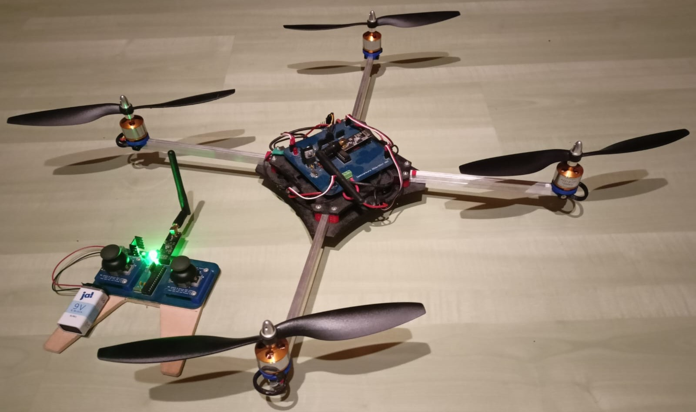

# Quadcopter

Originally, this was started  as seminar project by my brother and his classmates in 2017. 
The basis for this was the PDF included in the Doc folder. In 2019, the project was further 
developed by my brother and me. The software as well as the CAD parts were completely revised, 
the circuit boards for the drone and the remote control were taken over. To edit the CAD parts, 
we used Autodesk Inventor 2019. For printing the parts we were allowed to use the 3D printers 
of EULE in Schäbisch Gmünd. The control behavior of the drone was simulated in Matlab, and the 
self-written control elements were first parameterized accordingly. Unfortunately, the drone was
destroyed during the following flight attempts due to a connection failure.
